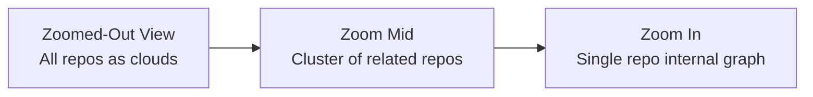
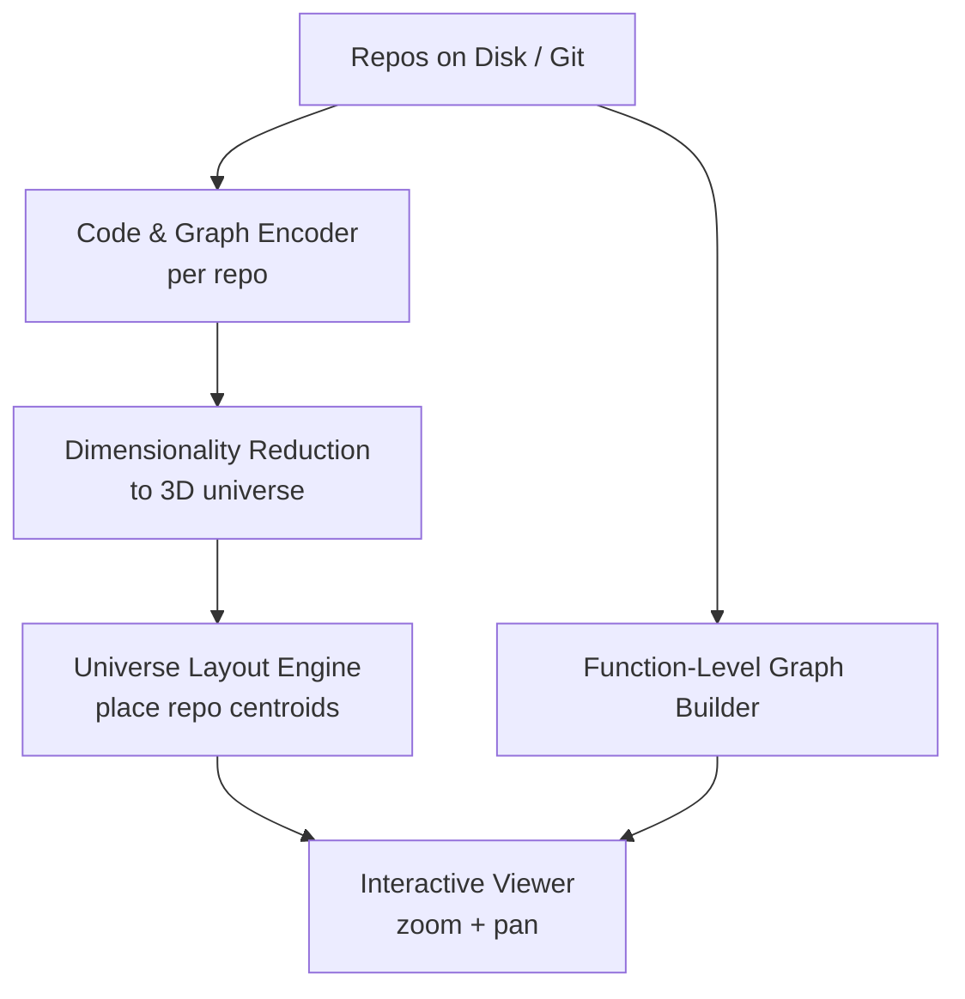

## Repository Universe Layout

### Concept
- We maintain a shared, continuous 3D “universe” where each repository sits at a position reflecting its semantic and structural similarity to every other repo. Close repos share code style/architecture/deps/functionality; distant repos differ in domain/language/structure.
- Zoomed-out (macro): each repo is a soft, semi-transparent cloud/halo in 3D space. The cloud centroid is the repo-level embedding; radius/shape can encode secondary properties (size, file count, dominant language).
- Zoomed-in (micro): selecting/zooming into a repo reveals its internal graph. Functions/methods/symbols are nodes; calls/imports/dataflow/etc. are thin wires (edges). Internal layout preserves:
  - Local similarity: closely related functions cluster together.
  - Global context: repo orientation is stable so similar modules across repos align similarly.
- Visually: a repo’s internal graph appears as a cluster of nodes and wires, wrapped in a subtle low-opacity “cloud” marking the repo boundary. Users can:
  - View all repos at once.
  - Smoothly zoom out for clusters/global structure.
  - Zoom in to inspect functions/edges/topology of a repo while keeping it situated in the shared 3D space.

### Concise Instruction (for configs/prompts)
Embed each repository into a shared latent space and project all repositories into a single 3D universe where spatial distance reflects semantic and structural similarity. At outer zoom, show each repository as a soft, semi-transparent cloud centered at its repo-level embedding. When zooming into a repository, expand that cloud into a function-level graph (nodes = functions/symbols; edges = calls/imports/dataflow as thin wires). Maintain a subtle, low-opacity hull around the nodes to indicate the repo boundary. Users must zoom smoothly from universe-scale to detailed internal graphs while preserving the sense of one continuous shared 3D space.

### Structural Overview

#### Universe → Repos → Functions
```mermaid
graph TD
    U[Repository Universe (3D Space)] --> R1[Repo A<br/>Repo-level Embedding]
    U --> R2[Repo B<br/>Repo-level Embedding]
    U --> R3[Repo C<br/>Repo-level Embedding]

    R1 --> A_f1[Func A.f1]
    R1 --> A_f2[Func A.f2]
    R1 --> A_f3[Func A.f3]

    R2 --> B_f1[Func B.f1]
    R2 --> B_f2[Func B.f2]

    A_f1 --> A_f2
    A_f2 --> A_f3
    B_f1 --> B_f2
```

#### Zoom levels


#### Data pipeline for spacing


### Current Implementation Notes
- Repo centroids: computed from repo-level vectors (`repo_vectors.npy`) and projected to 3D (`repo_coords.npy`).
- Node coords: per-function/class/module coords (`node_embeddings.npy` → PCA) and then offset by repo centroid.
- Spacing: `scripts/universe_lod.py` can optionally apply a force-directed spread on repo centroids (`--force-layout-iters`) and scale offsets (`--separate-repos-scale`) to reduce clumping.
- LODs: `lod_*.json` built for 10k/50k/200k node samples; auto-switched by zoom in the viewer.
- Edges: sampled edges for the 50k LOD (`edges_50000.jsonl`) render when a repo is selected; full edges stay off to preserve performance.
- Interaction: click a node to select its repo (highlights that repo, dims others, shows edges for the selected repo if available).

